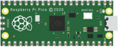
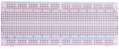

# Project 05：Traffic Lights

### **1. Introduction**

Traffic lights are closely related to people's daily lives. Traffic lights generally show red, yellow, and green. Everyone should obey the traffic rules, which can avoid many traffic accidents. In this project, we will use a pico board and some LEDs (red, green and yellow) to simulate the traffic lights.


### **2. Component Required**

|  |  |
| :----------------------------------------------------------: | :----------------------------------------------------------: |
|                     Raspberry Pi Pico*1                      |             Raspberry Pi Pico Expansion Board*1              |
|  |  |
|                          Red LED*1                           |                         Yellow LED*1                         |
|  |  |
|                         Green LED*1                          |                         USB Cable*1                          |
|  |  |
|                       220Ω Resistor*3                        |                         Breadboard*1                         |
|  |                                                              |
|                         Jumper Wires                         |                                                              |


### **3. Circuit Diagram and Wiring Diagram**


Note:

How to connect an LED


How to identify the 220Ω 5-band resistor


### **4. Test Code：**

You can open the code we provide:

Go to the folder KS3020 Keyestudio Raspberry Pi Pico Learning Kit Ultimate Edition\\2. Windows System\\2. C\_Tutorial\\2. Projects\\Project 05：Traffic Lights\\Project\_05\_Traffic\_Lights.

```c
//**********************************************************************
/*
 * Filename    : Traffic Lights
 * Description : Simulated traffic lights.
 * Auther      : http//www.keyestudio.com
*/
#define PIN_LED_RED   16   //define the red led pin
#define PIN_LED_YELLOW   17   //define the yellow led pin
#define PIN_LED_GREEN  18   //define the green led pin

void setup() {
  pinMode(PIN_LED_RED, OUTPUT);
  pinMode(PIN_LED_YELLOW, OUTPUT);
  pinMode(PIN_LED_GREEN, OUTPUT);
}

void loop() {
  digitalWrite(PIN_LED_GREEN, HIGH);// turns on the green led
delay(5000);// delays 5 seconds
digitalWrite(PIN_LED_GREEN, LOW); // turns off the green led
for(int i=0;i<3;i++)// flashes 3 times.
{
delay(500);// delays 0.5 second
digitalWrite(PIN_LED_YELLOW, HIGH);// turns on the yellow led
delay(500);// delays 0.5 second
digitalWrite(PIN_LED_YELLOW, LOW);// turns off the yellow led
} 
delay(500);// delays 0.5 second
digitalWrite(PIN_LED_RED, HIGH);// turns on the red led
delay(5000);// delays 5 second
digitalWrite(PIN_LED_RED, LOW);// turns off the red led
}
//**********************************************************************
```


Before uploading Test Code to Raspberry Pi Pico, please check the configuration of Arduino IDE.

Click "Tools" to confirm that the board type and ports.


Click  to upload the test code to the Raspberry Pi Pico board


### **5. Result**

Upload the code and power on, the green LED will light up for 5s then go off. Next, the yellow one will blink for 3 times and red LED will be on for 5s then go off.
