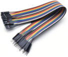

# Project 10：8×8 Dot-matrix Display

### **1. Introduction**

The dot-matrix display is an electronic digital display device that can show information on machines, clocks and many other devices. 

In this project, we will use the pico board control the 8x8 LED dot matrix to make a“❤”pattern.


### **2. Components Required**

|  |  |
| :----------------------------------------------------------: | :----------------------------------------------------------: |
|                     Raspberry Pi Pico*1                      |             Raspberry Pi Pico Expansion Board*1              |
|  |  |
|                  8*8 Dot-matrix Display *1                   |                       M-F Dupont Wires                       |
|  |                                                              |
|                         USB Cable*1                          |                                                              |


### **3. Component Knowledge**

**8*8 Dot-matrix display module:**

The 8\*8 dot matrix is composed of 64 LEDs, and each LED is placed at the intersection of a row and a column. When using a single-chip microcomputer to drive an 8\*8 dot matrix, we need to use a total of 16 digital ports, which greatly wastes the data of the single-chip microcomputer. 

For this reason, we specially designed this module, using the HT16K33 chip to drive an 8\*8 dot matrix, and only need to use the I2C communication port of the single-chip microcomputer to control the dot matrix, which greatly saves the microcontroller resources.

### **4. Specifications:**

- Working voltage: DC 5V

- Current: 200MA

- Maximum power: 1W


### **5. Schematic diagram:**


Some modules come with 3 DIP switches which allow you to toggle the switches at will. They are used to set the I2C communication address. The setting method is as follows. 

In our module, the module has fixed the communication address, A0, A1, A2 are all grounded, that is, the address is 0x70.

<table>
<tbody>
<tr class="odd">
<td>A0（1）</td>
<td>A1（2）</td>
<td>A2（3）</td>
<td>A0（1）</td>
<td>A1（2）</td>
<td>A2（3）</td>
<td>A0（1）</td>
<td>A1（2）</td>
<td>A2（3）</td>
</tr>
<tr class="even">
<td>0（OFF）</td>
<td>0（OFF）</td>
<td>0（OFF）</td>
<td>1（ON）</td>
<td>0（OFF）</td>
<td>0（OFF）</td>
<td>0（OFF）</td>
<td>1（ON）</td>
<td>0（OFF）</td>
</tr>
<tr class="odd">
<td>OX70</td>
<td>OX71</td>
<td>OX72</td>
<td></td>
<td></td>
<td></td>
<td></td>
<td></td>
<td></td>
</tr>
<tr class="even">
<td>A0（1）</td>
<td>A1（2）</td>
<td>A2（3）</td>
<td>A0（1）</td>
<td>A1（2）</td>
<td>A2（3）</td>
<td>A0（1）</td>
<td>A1（2）</td>
<td>A2（3）</td>
</tr>
<tr class="odd">
<td>1（ON）</td>
<td>1（ON）</td>
<td>0（OFF）</td>
<td>0（OFF）</td>
<td>0（OFF）</td>
<td>1（ON）</td>
<td>1（ON）</td>
<td>0（OFF）</td>
<td>1（ON）</td>
</tr>
<tr class="even">
<td>OX73</td>
<td>OX74</td>
<td>OX75</td>
<td></td>
<td></td>
<td></td>
<td></td>
<td></td>
<td></td>
</tr>
<tr class="odd">
<td>A0（1）</td>
<td>A1（2）</td>
<td>A2（3）</td>
<td>A0（1）</td>
<td>A1（2）</td>
<td>A2（3）</td>
<td></td>
<td></td>
<td></td>
</tr>
<tr class="even">
<td>0（OFF）</td>
<td>1（ON）</td>
<td>1（ON）</td>
<td>1（ON）</td>
<td>1（ON）</td>
<td>1（ON）</td>
<td></td>
<td></td>
<td></td>
</tr>
<tr class="odd">
<td>OX76</td>
<td>OX77</td>
<td></td>
<td></td>
<td></td>
<td></td>
<td></td>
<td></td>
<td></td>
</tr>
</tbody>
</table>


### **6. Circuit diagram and wiring diagram:**


### 7.Adding the Matrix library：

The project code uses a library called Matrix. If you haven't added it yet, add it before you study. If you want to add a third-party library, please perform the following steps:

Open the **Arduino IDE** and click “**Sketch**” → “**Include Library**” → “**Add.zip Library**...”. 

Find the directory named KS3020 Keyestudio Raspberry Pi Pico Learning Kit Ultimate Edition\2. Windows  System\2. C_Tutorial\3. Libraries\Matrix.Zip in the pop-up window, select the **Matrix.Zip** and click **“Open”**.


### **8. Test Code**

**After adding the Matrix library.**

You can open the code we provide:

Go to the folder KS3020 Keyestudio Raspberry Pi Pico Learning Kit Ultimate Edition\\2. Windows System\\2. C\_Tutorial\\2. Projects\\Project 10：8×8 Dot-matrix Display\\Project\_10\_8\_8\_Dot\_Matrix\_Display.

```c
//**********************************************************************************
/*
 * Filename    : 8×8 Dot-matrix Display
 * Description : 8x8 LED dot matrix display“Heart” pattern.
 * Auther      : http//www.keyestudio.com
*/
#include <Matrix.h>
Matrix myMatrix(20,21);
uint8_t LedArray1[8]={0x00,0x18,0x24,0x42,0x81,0x99,0x66,0x00};
uint8_t  LEDArray[8];
void setup(){
myMatrix.begin(0x70);
}

void loop(){
  myMatrix.clear();
  for(int i=0; i<8; i++)
  {
    LEDArray[i]=LedArray1[i];
    for(int j=7; j>=0; j--)
    {
      if((LEDArray[i]&0x01)>0)
      myMatrix.drawPixel(j, i,1);
      LEDArray[i] = LEDArray[i]>>1;
    }
  }
  myMatrix.writeDisplay();
}
//*******************************************************************************
```


Before uploading Test Code to Raspberry Pi Pico, please check the configuration of Arduino IDE.

Click "Tools" to confirm that the board type and ports.


Click  to upload the test code to the Raspberry Pi Pico board


### **9. Test Result：**

You will view the 8\*8 dot matrix show the“❤”pattern.
