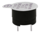

# Project 23：Flame Alarm

1.**Introduction**

In this project, we will use the pico board, a flame sensor and a buzzer to make fire alarm devices.

2.**Components Required**

|  |  |
| :----------------------------------------------------------: | :----------------------------------------------------------: |
|                     Raspberry Pi Pico*1                      |             Raspberry Pi Pico Expansion Board*1              |
|  |  |
|                        Flame Sensor*1                        |                          Red LED*1                           |
|  |  |
|                       Active Buzzer*1                        |                         Breadboard*1                         |
|  |  |
|                       220Ω Resistor*1                        |                       10KΩ Resistor*1                        |
|  |  |
|                         Jumper Wires                         |                         USB Cable*1                          |


3.**Component Knowledge**


**Flame Sensor**：

The flame emits a certain degree of IR light, which is invisible to the human eye, but our flame sensor can detect it and alert the microcontroller. 

If the Arduino has detected a fire, it has a specially designed infrared receiver to detect the flame, and then convert the flame brightness into a fluctuating level signal. 

The short pin of the receiving triode is negative pole and the other long pin is positive pole. We should connect the short pin (negative pole) to 5V and the long pin (positive pole) to the analog pin, a resistor and GND. 

As shown in the figure below.


**Note**: 

Since vulnerable to radio frequency radiation and temperature changes, the flame sensor should be kept away from heat sources like radiators, heaters and air conditioners, as well as direct irradiation of sunlight, headlights and incandescent light.


4.**Read the Simulation Value**

We start with a simple code to read the value of the flame sensor and print it on the serial monitor. For wiring, please refer to the following wiring diagram.


You can open the code we provide:

Go to the folder KS3020 Keyestudio Raspberry Pi Pico Learning Kit Ultimate Edition\\2. Windows System\\2. C\_Tutorial\\2. Projects\\Project 23：Flame Alarm\\Project\_23.1\_Read\_Analog\_Value\_Of\_Flame\_Sensor

```c
//**********************************************************************************
/*  
 * Filename    : Read Analog Value Of Flame Sensor
 * Description : Basic usage of ADC
 * Auther      : http//www.keyestudio.com
*/
#define PIN_ANALOG_IN  26  //the pin of the Flame Sensor

void setup() {
  Serial.begin(115200);
}

//In loop() function, analogRead is called to get the ADC value of ADC0 and assign it to adcVal. 
//Calculate the measured voltage value through the formula, and print these data through the serial port monitor.
void loop() {
  int adcVal = analogRead(PIN_ANALOG_IN);
  double voltage = adcVal / 1023.0 * 3.3;
  Serial.println("ADC Value: " + String(adcVal) + " --- Voltage Value: " + String(voltage) + "V");
  delay(500);
}
//**********************************************************************************
```


Before uploading Test Code to Raspberry Pi Pico, please check the configuration of Arduino IDE.

Click "Tools" to confirm that the board type and ports.


Click  to upload the test code to the Raspberry Pi Pico board


Upload the code, power up with a USB cable, open the monitor and set baud rate to 115200.

The monitor will show the analog value. When the sensor is closed to fire, the analog value will get greater.


5.**Circuit diagram and wiring diagram:**

We will make a fun project - fire alarm device using flame sensor and buzzer, LED. When the flame sensor detects a flame, the LED flashes and the buzzer alarms.


6.**Test Code:**

Note：you can set the threshold value.

You can open the code we provide:

Go to the folder KS3020 Keyestudio Raspberry Pi Pico Learning Kit Ultimate Edition\\2. Windows System\\2. C\_Tutorial\\2. Projects\\Project 23：Flame Alarm\\Project\_23.2\_Flame\_Alarm

```c
//**********************************************************************************
/*  
 * Filename    : Flame Alarm
 * Description : Controlling the buzzer and LED by flame sensor.
 * Auther      : http//www.keyestudio.com
*/
#define PIN_ADC0      26  //the pin of the flame sensor
#define PIN_LED       16  // the pin of the LED
#define PIN_BUZZER    17  // the pin of the buzzer

void setup() {
  pinMode(PIN_LED, OUTPUT);
  pinMode(PIN_BUZZER, OUTPUT);
  pinMode(PIN_ADC0, INPUT);
}

void loop() {
  int adcVal = analogRead(PIN_ADC0); //read the ADC value of flame sensor
  if (adcVal >= 500) {
    digitalWrite (PIN_BUZZER, HIGH); //turn on buzzer
    digitalWrite(PIN_LED, HIGH); // turn on LED
    delay(500); // wait a second.
    digitalWrite(PIN_LED, LOW); // turn off LED
    delay(500); // wait a second
  }
  else
  {
    digitalWrite(PIN_LED, LOW);  //turn off LED
    digitalWrite (PIN_BUZZER, LOW); //turn off buzzer
  }
}
//**********************************************************************************
```


Before uploading Test Code to Raspberry Pi Pico, please check the configuration of Arduino IDE.

Click "Tools" to confirm that the board type and ports.


Click  to upload the test code to the Raspberry Pi Pico board


7.**Result**

Upload the code and power up. monitor will display the value of the flame sensor. 

When the flame sensor detects the flame, the LED will flash and the buzzer will alarm; otherwise, the LED does not light up and the buzzer does not sound.
