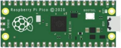
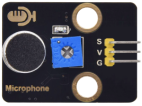
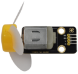

# Project 26：Sound Control Stepper Motor

### 1.**Introduction**

The sound sensor has a built-in capacitive electret microphone and power amplifier. It can be used to detect the sound intensity of the environment.

In this project, we use a sound sensor and a 130 motor to make a voice-activated smart fan.


### 2.**Components Required**

|  |  |
| :----------------------------------------------------------: | :----------------------------------------------------------: |
|                     Raspberry Pi Pico*1                      |             Raspberry Pi Pico Expansion Board*1              |
|  |  |
|                        Sound Sensor*1                        |                         USB Cable*1                          |
|  |  |
|                      130 Motor Module*1                      |                       F-F Dupont Wires                       |
|  |                                                              |
|                       M-F Dupont Wires                       |                                                              |


### 3.**Component Knowledge**


**Sound sensor** is usually used to detect the loudness of the sound in the surroundings. Arduino can collect its output signal through the analog input interface. The S pin is an analog output, which is the real-time output of the microphone voltage signal. The sensor comes with a potentiometer so you can adjust the signal strength. It also has two fixing holes so that the sensor can be installed on any other equipment. You can use it to make some interactive works, such as voice-operated switches.


### 4.**Read the Analog Value of the Sound Sensor**

We first use a simple code to read the analog value of the sound sensor and print it to the serial monitor, please refer to the following wiring diagram for the wiring.


You can open the code we provide:

Go to the folder KS3020 Keyestudio Raspberry Pi Pico Learning Kit Ultimate Edition\2. Windows  System\2. C_Tutorial\2. Projects\Project 26：Sound Control Fan\Project_26.1_Read_Sound_Sensor_Analog_Value

```c
//**********************************************************************************
/*  
 * Filename    : Read Sound Sensor Analog Value
 * Description : Basic usage of ADC
 * Auther      : http//www.keyestudio.com
*/
#define PIN_ANALOG_IN  28  //the pin of the Sound Sensor

void setup() {
  Serial.begin(115200);
}

//In loop() function, analogRead is called to get the ADC value of ADC0 and assign it to adcVal. 
//Calculate the measured voltage value through the formula, and print these data through the serial port monitor.
void loop() {
  int adcVal = analogRead(PIN_ANALOG_IN);
  double voltage = adcVal / 1023.0 * 3.3;
  Serial.println("ADC Value: " + String(adcVal) + " --- Voltage Value: " + String(voltage) + "V");
  delay(500);
}
//**********************************************************************************
```


Before uploading Test Code to Raspberry Pi Pico, please check the configuration of Arduino IDE.

Click "Tools" to confirm that the board type and ports.


Click  to upload the test code to the Raspberry Pi Pico board


Upload the code to the pico board, power up with a USB cable and open the serial monitor and set baud rate to 115200.

The monitor will show analog values of the sound sensor.


### 5.**Wiring Diagram：**


### 6.**Test Code：**

Note：you can set the thresh value in the code)

You can open the code we provide:

Go to the folder KS3020 Keyestudio Raspberry Pi Pico Learning Kit Ultimate Edition\\2. Windows System\\2. C\_Tutorial\\2. Projects\\Project 26：Sound Control Fan\\Project\_26.2\_Sound\_Control\_Fan

```c
//**********************************************************************************
/*  
 * Filename    : Sound Control Fan
 * Description : Controlling the fan by Sound sensor.
 * Auther      : http//www.keyestudio.com
*/
#define PIN_ADC2   28  //the pin of the Sound sensor
#define PIN_Motorla    17  // the Motor_IN+ pin of the motor
#define PIN_Motorlb    16  // the Motor_IN- pin of the motor
#define PIN_LED    25  // // the pin of the built-in LED on the Pico board

void setup() {
  pinMode(PIN_LED, OUTPUT);//set PIN_LED to OUTPUT
  pinMode(PIN_Motorla, OUTPUT);//set Motorla to OUTPUT
  pinMode(PIN_Motorlb, OUTPUT);//set Motorlb to OUTPUT
  pinMode(PIN_ADC2, INPUT);//set PIN_ADC2 to INPUT
}

void loop() {
  int adcVal = analogRead(PIN_ADC2); //read the ADC value of Sound sensor
  if (adcVal > 600) {
    digitalWrite(PIN_LED,HIGH); //turn on the built-in LED on the Pico board
    digitalWrite(PIN_Motorla,HIGH); //rotate
    digitalWrite(PIN_Motorlb,LOW);
    delay(5000); //delay 5S
  }
  else
  {
    digitalWrite(PIN_LED,LOW); //turn off the built-in LED on the Pico board
    digitalWrite(PIN_Motorla,LOW); //stop rotating
    digitalWrite(PIN_Motorlb,LOW); 
  }
}
//**********************************************************************************
```


Before uploading Test Code to Raspberry Pi Pico, please check the configuration of Arduino IDE.

Click "Tools" to confirm that the board type and ports.


Click  to upload the test code to the Raspberry Pi Pico board


### 7.**Test Result**

Upload the code and power up. 

Clap your hands before the sound sensor, when the sound intensity exceeds the thresh value, the fan will rotate and the LED on the pico board will be on; on the contrary, the fan won’t rotate and the LED will be off.
