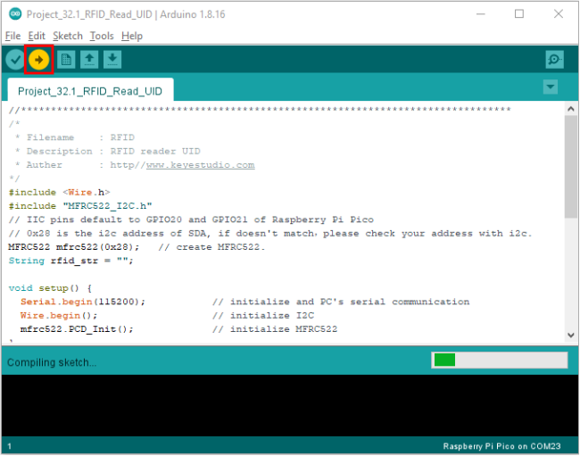

# Project 32：RFID

### 1.**Introduction**

Nowadays, many residential districts use this function to open the door by swiping the card, which is very convenient. 

In this lesson, we will learn how to use RFID(radio frequency identification) wireless communication technology and read and write the key chain card (white card) and control the steering gear rotation by RFID-MFRC522 module.


### 2.**Components Required**

|  |  |  |
| :----------------------------------------------------------: | :----------------------------------------------------------: | :----------------------------------------------------------: |
|                     Raspberry Pi Pico*1                      |             Raspberry Pi Pico Expansion Board*1              |                    RFID-MFRC522 Module*1                     |
|  |  |  |
|                         Key Chain*1                          |                       F-F Dupont Wires                       |                           Servo*1                            |
|  |  |                                                              |
|                         White Card*1                         |                         USB Cable*1                          |                                                              |


### 3.**Component Knowledge**

**RFID**

RFID (Radio Frequency Identification) is a wireless communication technology. A complete RFID system generally consists of a transponder and a reader. Usually we use tags as transponders, and each tag has a unique code attached to the object to identify the target object. The reader is a device that reads (or writes) tag information.

Products derived from RFID technology can be divided into three categories: passive RFID products, active RFID products and semi-active RFID products. 

However, the passive RFID products are the earliest, most mature and most widely used products on the market, which can be seen everywhere in our daily life, such as bus card, meal card, bank card, hotel access card, etc., which are close contact identification. 

The main operating frequencies of the passive RFID products are 125KHZ(low frequency), 13.56mhz (high frequency), 433MHZ(UHF), and 915MHZ(UHF). The active and the semi-active RFID products operate at higher frequencies.

The RFID module we use is a passive RFID product with a working frequency of 13.56MHz. 

**RFID-RC522 Module** 

The MFRC522 is a highly integrated reader/writer IC for 13.56MHz contactless communication. Its internal transmitter is capable of driving a read/write antenna, which is designed to communicate with ISO/IEC 14443A /MIFARE cards and transponders without the need for additional active circuits . 

The receiving module provides an efficient implementation of demodulation and decoding of signals from ISO/IEC 14443 A /MIFARE compatible cards and transponders. 

The digital module manages complete ISO/IEC 14443A framing and error detection (parity and CRC) features.  

The RFID module uses the MFRC522 as the control chip and adopts I2C (Inter-Integrated Circuit) interface.


### 4.**Specifications:**

- Operating voltage: DC 3.3V-5V
- Operating current: 13—100mA/DC 5V
- Idling current: 10-13mA/DC 5V
- Sleep current: <80uA
- Peak current: <100mA
- Operating frequency: 13.56MHz
- Maximum power: 0.5W
- Supported card types: mifare1 S50、mifare1 S70、mifare UltraLight、mifare Pro、mifare Desfire
- Environmental operating temperature:  -20 to 80 degrees Celsius
- Environment storage temperature: -40 to 85 degrees Celsius
- Relative Humidity: 5% to 95%
- Data transfer rate: The maximum is 10Mbit/s.


### 5.**Read the Card Number Value**

We will read the UNIQUE ID number (UID) of the RFID card and identify its type . And display relevant information through the "Shell" window of Thonny IDE. 

The wiring diagram is as follows:


### 6.**Adding the MFRC522\_I2C and Wire libraries：**

Open Arduino IDE and click“Sketch”→“Include Library”→“Add .zip Library...”.

Go to the folder KS3020 Keyestudio Raspberry Pi Pico Learning Kit Ultimate Edition\2. Windows  System\2. C_Tutorial\3.Libraries\MFRC522_I2C.Zip and click MFRC522_I2C.Zip and click“Open”.


Go to the folder KS3020 Keyestudio Raspberry Pi Pico Learning Kit Ultimate Edition\2. Windows  System\2. C_Tutorial\3.Libraries\Wire.Zip and click Wire.Zip and click“Open”


**RFID reads UID：**

After the library “**MFRC522_I2C**” and "**Wire**” are added，you can open the code:

KS3020 Keyestudio Raspberry Pi Pico Learning Kit Ultimate Edition\2. Windows  System\2. C_Tutorial\2. Projects\Project 32：RFID\Project_32.1_RFID_Read_UID.

```c
//**********************************************************************************
/*  
 * Filename    : RFID
 * Description : RFID reader UID
 * Auther      : http//www.keyestudio.com
*/
#include <Wire.h>
#include "MFRC522_I2C.h"
// IIC pins default to GPIO20 and GPIO21 of Raspberry Pi Pico
// 0x28 is the i2c address of SDA, if doesn't match，please check your address with i2c.
MFRC522 mfrc522(0x28);   // create MFRC522.
String rfid_str = "";

void setup() {
  Serial.begin(115200);           // initialize and PC's serial communication
  Wire.begin();                   // initialize I2C
  mfrc522.PCD_Init();             // initialize MFRC522
}

void loop() {
  // 
  if ( ! mfrc522.PICC_IsNewCardPresent() || ! mfrc522.PICC_ReadCardSerial() ) {
    delay(50);
    return;
  }
  
  rfid_str = "";//String emptying
  Serial.print(F("Card UID:"));
  for (byte i = 0; i < mfrc522.uid.size; i++) {
    rfid_str = rfid_str + String(mfrc522.uid.uidByte[i], HEX);  //Convert to string
    //Serial.print(mfrc522.uid.uidByte[i] < 0x10 ? " 0" : " ");
    //Serial.print(mfrc522.uid.uidByte[i], HEX);
  } 
  Serial.println(rfid_str);
}
//**********************************************************************************
```


Before uploading Test Code to Raspberry Pi Pico, please check the configuration of Arduino IDE.

Click "Tools" to confirm that the board type and ports.





Upload the code to the pico board, power up with a USB cable and open the serial monitor and set baud rate to 115200.

Attach the key to the sensing area blank card, the monitor will show information as follows:


Note: the door card value and key chain value may be different for different RRFID -RC522 door cards and key chains.  


### 7.**Circuit Diagram and Wiring diagram**

Now we use a RFID-RC522 module, door card/key chain and servo to simulate an intelligent access control system. When the door card is close to the RFID-RC522 module induction area, the servo rotates. 

Wiring according to the figure below:


### 8.**Adding library MFRC522\_I2C，Wire and Servo：**

If both of them are added, just skip this step,.

Add the Servo library：

Open Arduino IDE，click“Sketch”→“Include Library”→“Add .zip Library...”

Go to the folder KS3020 Keyestudio Raspberry Pi Pico Learning Kit Ultimate Edition\2. Windows  System\2. C_Tutorial\3.Libraries\ Servo.Zip, click Servo.Zip and“Open”


Add the library MFRC522\_I2C and Wire:

If you add MFRC522\_I2Cand Wire, you don’t need to add them.


### 9.**Test Code：**

Go to the code KS3020 Keyestudio Raspberry Pi Pico Learning Kit Ultimate Edition\2. Windows  System\2. C_Tutorial\2. Projects\Project 32：RFID\Project_32.2_RFID_Control_Servo

Values detected by the RFID-MFRC522 and the blank card are different.

Replace values in the code with values read by the RFID-MFRC522 module and the blank card. Otherwise, the servo will not be controlled.

For example, replace values marked with red boxes with values of RFID-MFRC522 and blank card:


```c
//*************************************************************************************
/* 
 * Filename    : RFID mfrc522 Control Servo
 * Description : RFID controlled steering gear simulated door opening
 * Auther      : http//www.keyestudio.com
*/
#include <Servo.h>
#include <Wire.h>
#include <MFRC522_I2C.h>
MFRC522 mfrc522(0x28);
Servo myservo;
String rfid_str = "";

void setup() {
  Serial.begin(115200);
  Wire.begin();
  mfrc522.PCD_Init();
  myservo.attach(2);//Steering gear is connected to number port 2
  myservo.write(0);//Initial Angle is 0 degrees
  delay(500);
}

void loop() {
   if ( ! mfrc522.PICC_IsNewCardPresent() || ! mfrc522.PICC_ReadCardSerial() ) {
    delay(50);
    return;
  }
  rfid_str = ""; //String emptying
  Serial.print(F("Card UID:"));
  for (byte i = 0; i < mfrc522.uid.size; i++) {
    rfid_str = rfid_str + String(mfrc522.uid.uidByte[i], HEX);  //Convert to string
    //Serial.print(mfrc522.uid.uidByte[i] < 0x10 ? " 0" : " ");
    //Serial.print(mfrc522.uid.uidByte[i], HEX);
  } 
  Serial.println(rfid_str); 
  if (rfid_str == "93adf720" || rfid_str == "39b646c2") {
    myservo.write(180);            // Open the switch
    delay(500);
    Serial.println("  open the door!");
    }
}
//***********************************************************************************
```


Before uploading Test Code to Raspberry Pi Pico, please check the configuration of Arduino IDE.

Click "Tools" to confirm that the board type and ports.


Click  to upload the test code to the Raspberry Pi Pico board


### 10.**Test Result：**

Upload the code to the pico board, power up with a USB cable and open the serial monitor and set baud rate to 115200.

When you use the key to open the door, the monitor will show information of the blank card and the key chain and “open the door”.


