# Project 34：IR Control Sound and LED

### 1.**Introduction**

Infrared remote control is a low-cost, easy-to-use wireless communication technology. IR light is very similar to visible light, except that it has a slightly longer wavelength. This means that infrared rays cannot be detected by the human eye, which is perfect for wireless communication. 

For example, when you press a button on the TV remote control, an infrared LED will switch on and off repeatedly at a frequency of 38,000 times per second, sending information (such as volume or channel control) to the infrared sensor on the TV.

We will first explain how common IR communication protocols work. Then we will start this project with a remote control and an IR receiving component.


### 2.**Components Required**

|  |  |  |
| :----------------------------------------------------------: | :----------------------------------------------------------: | :----------------------------------------------------------: |
|                     Raspberry Pi Pico*1                      |             Raspberry Pi Pico Expansion Board*1              |                        IR Receiver *1                        |
|  |  | 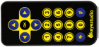 |
|                          RGB LED*1                           |                        220ΩResistor*3                        |                     IR Remote Control*1                      |
|  |  |  |
|                         Breadboard*1                         |                       Passive Buzzer*1                       |                        10KΩResistor*1                        |
|  |  |                                                              |
|                         Jumper Wires                         |                         USB Cable*1                          |                                                              |


### 3.**Component Knowledge**

**IR Remote Controller**: 

It is a device that has a certain number of buttons. Pressing different buttons causes the infrared transmitter tubes at the front of the remote control to send infrared signals in different codes. 

Infrared remote control technology is widely used, such as TV, air conditioner and so on. Therefore, in today's technologically advanced society, the infrared remote control technology makes it very convenient for us to change TV programs and adjust the temperature of the air conditioner.  

The remote control we used is as follows:

The infrared remote controller adopts NEC code and the signal cycle is 110ms.


**IR Receiver:** 

It is a component that can receive infrared light, which can be used to detect the infrared signal sent by the infrared remote control. The infrared signal received by the infrared receiver demodulation can be converted back to binary, then the information will be passed to a microcontroller.

**Process Diagram：**


NEC Infrared communication protocol：

**NEC Protocol**

To my knowledge the protocol I describe here was developed by NEC (Now Renesas). I've seen very similar protocol descriptions on the internet, and there the protocol is called Japanese Format. 

I do admit that I don't know exactly who developed it. What I do know is that it was used in my late VCR produced by Sanyo and was marketed under the name of Fisher. NEC manufactured the remote control IC. 

This description was taken from my VCR's service manual. Those were the days, when service manuals were filled with useful information! 

### 4.**Features**

- 8 bit address and 8 bit command length.
- Extended mode available, doubling the address size.

- Address and command are transmitted twice for reliability.

- Pulse distance modulation.

- Carrier frequency of 38kHz.

- Bit time of 1.125ms or 2.25ms.

**Modulation**

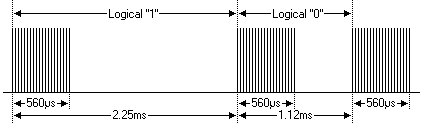

The NEC protocol uses pulse distance encoding of the bits. Each pulse is a 560µs long 38kHz carrier burst (about 21 cycles). A logical "1" takes 2.25ms to transmit, while a logical "0" is only half of that, being 1.125ms. The recommended carrier duty-cycle is 1/4 or 1/3.

Protocol


The picture above shows a typical pulse train of the NEC protocol. With this protocol the LSB is transmitted first. In this case Address $59 and Command $16 is transmitted. 

A message is started by a 9ms AGC burst, which was used to set the gain of the earlier IR receivers. This AGC burst is then followed by a 4.5ms space, which is then followed by the Address and Command. Address and Command are transmitted twice. 

The second time all bits are inverted and can be used for verification of the received message. The total transmission time is constant because every bit is repeated with its inverted length. 

If you're not interested in this reliability you can ignore the inverted values, or you can expand the Address and Command to 16 bits each! 

Keep in mind that one extra 560µs burst has to follow at the end of the message in order to be able to determine the value of the last bit.

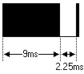

A command is transmitted only once, even when the key on the remote control remains pressed. Every 110ms a repeat code is transmitted for as long as the key remains down. This repeat code is simply a 9ms AGC pulse followed by a 2.25ms space and a 560µs burst.


**Extended NEC protocol**

The NEC protocol is so widely used that soon all possible addresses were used up. By sacrificing the address redundancy the address range was extended from 256 possible values to approximately 65000 different values. This way the address range was extended from 8 bits to 16 bits without changing any other property of the protocol. 

By extending the address range this way the total message time is no longer constant. It now depends on the total number of 1's and 0's in the message. If you want to keep the total message time constant you'll have to make sure the number 1's in the address field is 8 (it automatically means that the number of 0's is also 8). This will reduce the maximum number of different addresses to just about 13000. 

The command redundancy is still preserved. Therefore each address can still handle 256 different commands.

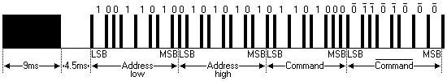

Keep in mind that 256 address values of the extended protocol are invalid because they are in fact normal NEC protocol addresses. Whenever the low byte is the exact inverse of the high byte it is not a valid extended address.

### 5.**Decoding：**

Wire up the pico board

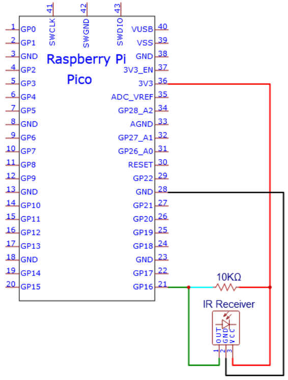

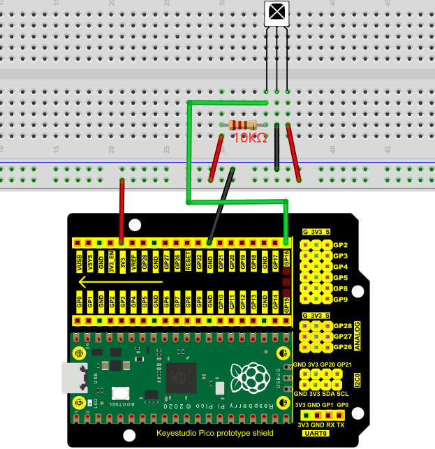

You can open the code we provide:

Go to the folder KS3020 Keyestudio Raspberry Pi Pico Learning Kit Ultimate Edition\2. Windows  System\2. C_Tutorial\2. Projects\Project 34：IR Control Sound and LED\Project_34.1_Decoded_IR_Signal

```c
//**********************************************************************************
/*  
 * Filename    : Decoded IR Signal
 * Description : Decode the infrared remote control and print it out through the serial port.
 * Auther      : http//www.keyestudio.com
*/
#include "IR.h"
#define IR_Pin 16

void setup() {
  Serial.begin(115200);
  IR_Init(IR_Pin);
}

void loop() {
  if(flagCode){
    int irValue = IR_Decode(flagCode);
    Serial.println(irValue, HEX);
    IR_Release();
  }
}
//**********************************************************************************
```


Before uploading Test Code to Raspberry Pi Pico, please check the configuration of Arduino IDE.

Click "Tools" to confirm that the board type and ports.

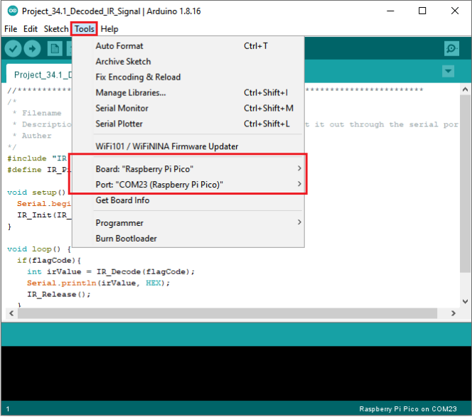

Click  to upload the test code to the Raspberry Pi Pico board


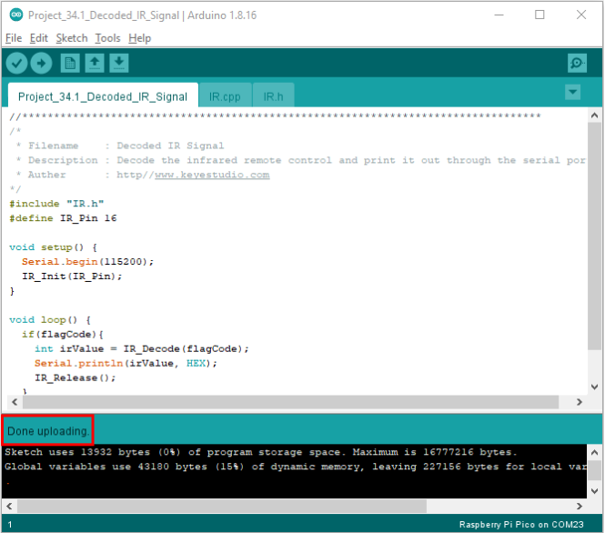

Upload the code to the pico board, power up with a USB cable and open the serial monitor and set baud rate to 115200. Point the remote control at the IR receiver, the monitor will show key values


Code value of the remote control


Circuit diagram and wiring diagram:


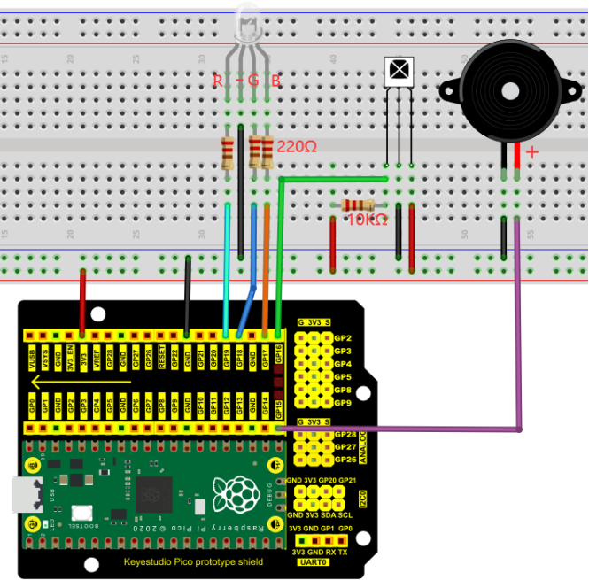

### 6.**Test Code**

Go to the folder KS3020 Keyestudio Raspberry Pi Pico Learning Kit Ultimate Edition\2. Windows  System\2. C_Tutorial\2. Projects\Project 34：IR Control Sound and LED\Project_34.2_IR_Control_Sound_And_LED

```c
//**********************************************************************************
/*  
 * Filename    : IR Control Sound And LED
 * Description : Remote control RGB and Passive buzzer with infrared remote control.
 * Auther      : http//www.keyestudio.com
*/
#include "IR.h"

#define irPin 16
#define R_Pin 19
#define G_Pin 18
#define B_Pin 17
#define buzzerPin 15

void setup() {
  Serial.begin(115200);
  IR_Init(irPin);
  pinMode(R_Pin, OUTPUT);
  pinMode(G_Pin, OUTPUT);
  pinMode(B_Pin, OUTPUT);
  pinMode(buzzerPin, OUTPUT);
}

void loop() {
  if(flagCode){
    int irValue = IR_Decode(flagCode);
    Serial.println(irValue, HEX);
    handleControl(irValue);
    IR_Release();
  }
}

void handleControl(unsigned long value) {

  // Handle the commands
  if (value == 0xFF6897) // Receive the number '1'
  { 
      analogWrite(R_Pin, 255); //Common cathode LED, high level to turn on the led.
      analogWrite(G_Pin, 0);
      analogWrite(B_Pin, 0);
      tone(buzzerPin, 262);//DO play 1000ms
      delay(1000);
  }
   else if (value == 0xFF9867) // Receive the number '2'
   { 
      analogWrite(R_Pin, 0); 
      analogWrite(G_Pin, 255); //Common cathode LED, high level to turn on the led.
      analogWrite(B_Pin, 0);
      tone(buzzerPin, 294);//Re play 750ms
      delay(750);
   }
    else if (value == 0xFFB04F) // Receive the number '3'
   { 
      analogWrite(R_Pin, 0); 
      analogWrite(G_Pin, 0);
      analogWrite(B_Pin, 255); //Common cathode LED, high level to turn on the led.
      tone(buzzerPin, 330);//Mi play 625ms
      delay(625);
    }
    else if (value == 0xFF30CF) // Receive the number '4'
   {  
      analogWrite(R_Pin, 255); 
      analogWrite(G_Pin, 255);
      analogWrite(B_Pin, 0);
      tone(buzzerPin, 349);//Fa play 500ms
      delay(500);
    }
    else if (value == 0xFF18E7) // Receive the number '5'
   {  
      analogWrite(R_Pin, 255); 
      analogWrite(G_Pin, 0);
      analogWrite(B_Pin, 255);
      tone(buzzerPin, 392);//So play 375ms
      delay(375);
    }
    else if (value == 0xFF7A85)  // Receive the number '6'
   {  
      analogWrite(R_Pin, 0); 
      analogWrite(G_Pin, 255);
      analogWrite(B_Pin, 255);
      tone(buzzerPin, 440);//La play 250ms
      delay(250);
    }
    else if (value == 0xFF10EF)  // Receive the number '7'
   {   
      analogWrite(R_Pin, 255); 
      analogWrite(G_Pin, 255);
      analogWrite(B_Pin, 255);
      tone(buzzerPin, 494);//Si play 125ms
      delay(125);
    }
    else{
      analogWrite(R_Pin, 0); 
      analogWrite(G_Pin, 0);
      analogWrite(B_Pin, 0);
      noTone(buzzerPin);//Si play 125ms
      delay(1000);
      }
  }
//**********************************************************************************
```


Before uploading Test Code to Raspberry Pi Pico, please check the configuration of Arduino IDE.

Click "Tools" to confirm that the board type and ports.


Click  to upload the test code to the Raspberry Pi Pico board

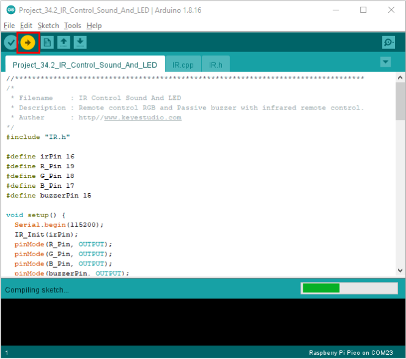

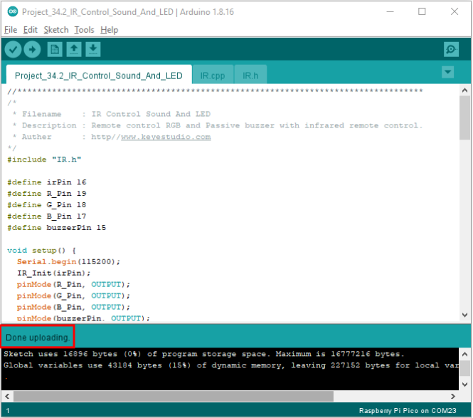

### 7.**Test Result：**

Upload the code and power up. Press the key 1-7, the buzzer will emit do, re, mi, fa, sol, la and si, at same time, the RGB will show red, green, blue, yellow, dark red, blue-green and white color. If pressing the rest of keys, the buzzer will stop playing and the RGB will be off.

Note: you need to peel off the plastic film covered on the remote control.


**IR.cpp**

```c
#include "IR.h"

int logList[32];
unsigned long startTime;
int endTime, end2Time;
int flagCode = 0;
int irPin;
bool irState = true;

void IR_Init(int pin) {
  irPin = pin;
  pinMode(irPin, INPUT_PULLUP);
  attachInterrupt(digitalPinToInterrupt(irPin), IR_Read, CHANGE);
}

void IR_Read() {
  if (irState == true) {
    unsigned long lowTime, highTime, intervalTime;
    int num = 0;
    while (digitalRead(irPin) == LOW) {
      startTime = micros();
      while (digitalRead(irPin) == LOW) {
        lowTime = micros();
      }
      intervalTime = lowTime - startTime;
      while (digitalRead(irPin) == HIGH) {
        highTime = micros();
        intervalTime = highTime - lowTime;
        if (intervalTime > 10000) {
          end2Time = millis();
          if (num == 32) {
            flagCode = 1;
            endTime = millis();
          }
          else if (num == 0 && end2Time - endTime > 300 && end2Time - endTime < 400) {
            flagCode = 2;
            endTime = millis();
          }
          return;
        }
      }
      if (intervalTime < 2000) {
        if (intervalTime < 700) {
          logList[num ++] = 0;
        }
        else {
          logList[num ++] = 1;
        }
      }
    }
  }
}

unsigned long IR_Decode(int &code) {
  unsigned long irData = 0;
  irState=false;
  if (code == 1) {
    code = 0;
    for (int i = 0; i < 32; i ++) {
      if (logList[i] == 0) {
        irData <<= 1;
      }
      else {
        irData <<= 1;
        irData ++;
      }
      logList[i] = 0;
    }
  }
  if (code == 2) {
    code = 0;
    irData = 0xffffffff;
  }
  return irData;
}

void IR_Release(){
  irState=true;
}
```

